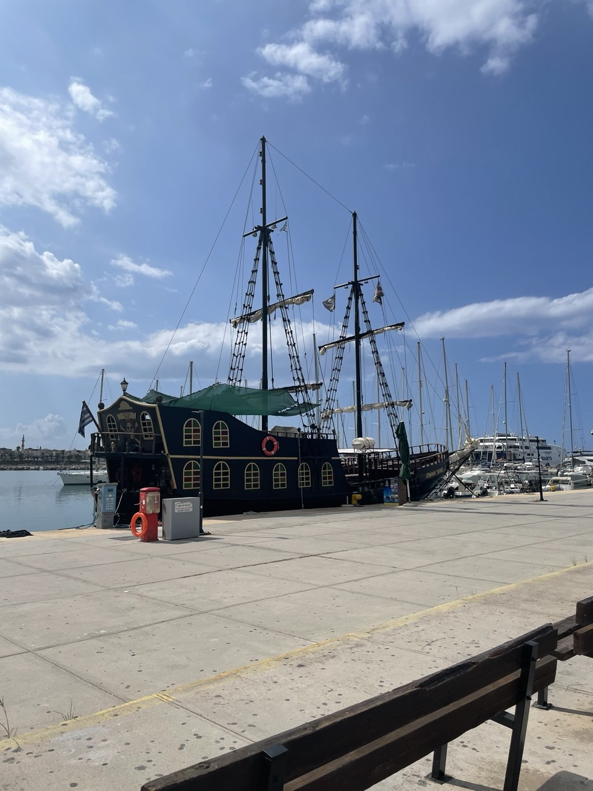
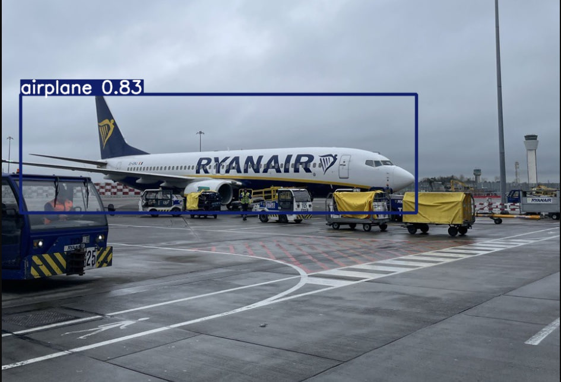

<h1>Курсовая работа по дисциплине Computer Vision</h1>

Выполнил студент группы М8О-209М-23:

<ul>
  <li>Пешков Максим Юрьевич</li>
</ul>

<h2>Задачи:</h2>
<ul>
  <li>Детекция объектов на изображении</li>
  <li>Классификация объектов на изображении</li>
  <li>Сегментация объектов на изображении</li>
  <li>Детекция объектов на видео</li>
  <li>Классификация объектов на видео</li>
  <li>Сегментация объектов на видео</li>
</ul>

<h2>Объекты:</h2>
<ul>
  <li>Самолеты (airplanes)</li>
  <li>Водный транспорт (boat)</li>
</ul>

<h2>Сервис:</h2>
<ul>
  <li>Архитектура нейронной сети: YOLO8</li>
  <li>Данные: COCO Dataset</li>
  <li>Для сохранения результатов используется локальное хранилище</li>
  <li>Для реализации API используется фреймворк FastAPI</li>
  <li>Развертывание сервиса в Docker</li>
</ul>

При достижении финиша Шрек проходит уровень лабиринта и выигрывает, а при получении урона (весомых аргументов против утверждений Шрека) от непрошенного гостя – теряет здоровье и проигрывает.

<h2>Функционал сервиса:</h2>

С помощью API пользователь загружает изображение/видео для детекции/классификации/сегментации/трекинга. Сервис производит обработку материала и создает файл (изображение/видео) результата на локальном хранилище, присваивая ему индивидуальный id. По сформированному id пользователь может скачать необходимое изображение или видео с результатом работы (классификация/детекция/сегментирование/трекинг).

<h2>Запуск сервиса:</h2>

<ul>
  <li>Необходимо в терминале ввести: docker-compose up --build -d</li>
  <li>Зайти в браузере на <href>http://localhost:8000/docs</href></li>
  <li>После попадания в Swagger можно пользоваться API</li>
</ul>

<h2>Описание API:</h2>
<ul>
  <li>[POST] /upload_image_detection - загрузка изображения для классификации и детекции - в качестве результата возвращается id </li>
  <li>[POST] /upload_image_segmentation - загрузка изображения для сегментации - в качестве результата возвращается id </li>
  <li>[POST] /upload_video - загрузка видео для трекинга - в качестве результата возвращается id </li>
  <li>[GET] /status/{task_id} - запрос на получение статуса по завершению операции по id - в качестве результата возвращается json со статусом:
    <ul>
      <li>"done" - Обработка выполнена успешно</li>
      <li>"error" - Во время обработки возникла ошибка</li>
    </ul>
  <li>[GET] /result/{task_id} - запрос на получение результата операции по id - в качестве результата возвращается json со статусом:
    <ul>
      <li>"Task not found" - Результат не найден (операция не совершалась)</li>
      <li>"Result not ready" - Результат еще не готов (дфнные находятся в обработке)</li>
      <li>"Result file not found" - Результат отсутствует</li>
    </ul>
  <li>[GET] /download/{task_id} - запрос на скачивание результата (изображение/видео) по id - в качестве результата возвращается ссылка Download </li>
</ul>

<h2>Результаты работы сервиса:</h2>

<figure>
   
   <figcaption>Рисунок 1 - Изображение 1 для детекции и классификации</figcaption>
  </figure>

  <figure>
   
   <figcaption>Рисунок 2 - Изображение 1 - результат</figcaption>
  </figure>

<figure>
   
   <figcaption>Рисунок 3 - Изображение 2 для детекции и классификации</figcaption>
  </figure>

  <figure>
   
   <figcaption>Рисунок 4 - Изображение 2 - результат</figcaption>
  </figure>

<figure>
   
   <figcaption>Рисунок 5 - Изображение 3 для детекции и классификации и сегментации</figcaption>
  </figure>

  <figure>
   
   <figcaption>Рисунок 6 - Изображение 3 - результат</figcaption>
  </figure>

