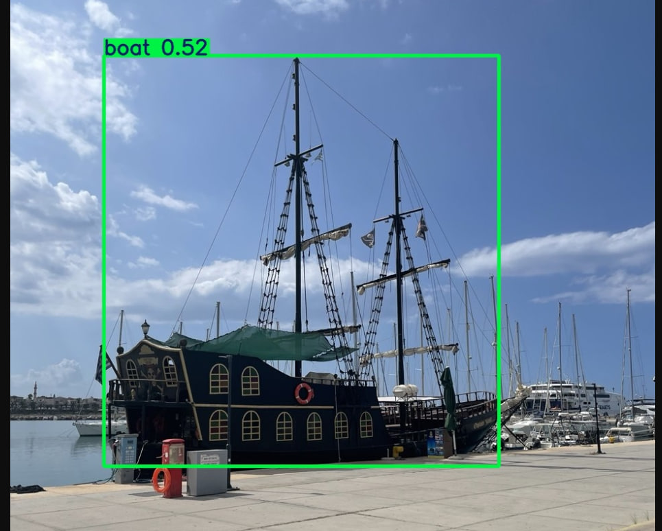

<h1>Coursework on the subject "Computer Vision"</h1>

Completed by student of group M8O-209M-23:

<ul>
  <li>Пешков Максим Юрьевич</li>
</ul>

<h2>Tasks:</h2>
<ul>
  <li>Detection of objects in an image</li>
  <li>Classification of objects in an image</li>
  <li>Segmentation of objects in an image</li>
  <li>Object detection in video</li>
  <li>Classification of objects in video</li>
  <li>Segmentation of objects in video</li>
</ul>

<h2>Objects:</h2>
<ul>
  <li>Airplanes</li>
  <li>Boats</li>
</ul>

<h2>Service:</h2>
<ul>
  <li>Neural network architecture: YOLO8</li>
  <li>Data: COCO Dataset</li>
  <li>Local storage is used to save results</li>
  <li>The FastAPI framework is used to implement the API</li>
  <li>Deploying in Docker</li>
</ul>

<h2>Service functionality:</h2>

Using the API, the user uploads an image/video for detection/classification/segmentation/tracking. The service processes the material and creates a file (image/video) of the result in the local storage, assigning it an individual id. Using the generated id, the user can download the required image or video with the result of the work (classification/detection/segmentation/tracking).

<h2>Launching the service:</h2>

<ul>
  <li>You need to enter the following in the terminal: docker-compose up --build -d</li>
  <li>Go to the browser at <href>http://localhost:8000/docs</href></li>
  <li>Once you get into Swagger, you can use the API</li>
</ul>

<h2>API description:</h2>
<ul>
  <li>[POST] /upload_image_detection - loading an image for classification and detection - id is returned as a result </li>
  <li>[POST] /upload_image_segmentation - loading image for segmentation - id is returned as result </li>
  <li>[POST] /upload_video - uploading video for tracking - id is returned as result </li>
  <li>[GET] /status/{task_id} - request to get the status of the completion of an operation by id - json with the status is returned as a result:
    <ul>
      <li>"done" - Processing completed successfully</li>
      <li>"error" - An error occurred during processing</li>
    </ul>
  <li>[GET] /result/{task_id} - request to get the result of an operation by id - json with the status is returned as a result:
    <ul>
      <li>"Task not found" - Result not found (operation not performed)</li>
      <li>"Result not ready" - The result is not ready yet (data is being processed)</li>
      <li>"Result file not found" - No result</li>
    </ul>
  <li>[GET] /download/{task_id} - request to download the result (image/video) by id - the Download link is returned as the result </li>
</ul>

<h2>Results of the service:</h2>

<figure>
   
   <figcaption>Image 1 - Image 1 for detection and classification</figcaption>
  </figure>

  <figure>
   
   <figcaption>Image 2 - Image 1 - result</figcaption>
  </figure>

<figure>
   
   <figcaption>Image 3 - Image 2 for detection and classification</figcaption>
  </figure>

  <figure>
   
   <figcaption>Image 4 - Image 2 - result</figcaption>
  </figure>

<figure>
   
   <figcaption>Image 5 - Image 3 for detection and classification and segmentation</figcaption>
  </figure>

  <figure>
   
   <figcaption>Image 6 - Image 3 - result</figcaption>
  </figure>

